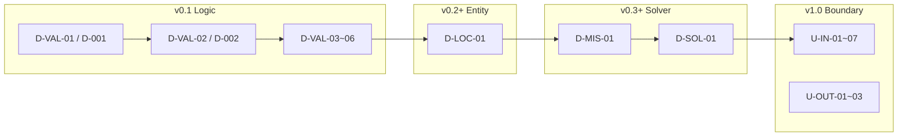

# MagicSquare_1004 — Dual-Track RED 설계표

> `/tdd-red` Command · `.cursor/skills/magic-square-tdd/reference.md`와 함께 사용  
> **RED 단계:** 테스트만 작성 · `src/` 수정 금지 · Expected RED Failure = pytest 실행 시 기대되는 실패 유형  
> 체크리스트·진행 ToDo: **[RED-TODO.md](RED-TODO.md)**

---

## 공통 정의

### 픽스처 (Given)

| ID | 설명 | 4×4 격자 (row-major) |
|----|------|----------------------|
| **G0** | 완성 마방진 (슬라이드 정답) | `[[16,3,2,13],[5,10,11,8],[9,6,7,12],[4,15,14,1]]` |
| **G1** | OO 과제 — 빈칸 2개 `(2,2)`, `(3,3)` (1-index) | `[[16,3,2,13],[5,0,11,8],[9,6,0,12],[4,15,14,1]]` |
| **G2** | Mom S2 — 대각선 1개만 합≠34 (행·열 OK) | G1에 7·10 채웠으나 ↙ 대각선만 틀린 변형 |
| **G3** | 행 1개 합≠34 | G0 기반, 한 행만 값 교란 |
| **G4** | 열 1개 합≠34 | G0 기반, 한 열만 값 교란 |
| **G5** | 1~16 중복 | G0 기반, 두 칸 동일 값 |
| **G6** | 범위 위반 (17 또는 0×3) | 시나리오별 |

좌표는 **1-index** (행·열 1~4). 솔버 성공 출력: `int[6]` → `[r1,c1,n1,r2,c2,n2]`.

### 오류 코드 (Boundary 전담 — E001~E007)

| 코드 | 이름 | 조건 |
|------|------|------|
| E001 | `INVALID_SIZE` | 4×4가 아님 (예: 3×4, 1차원) |
| E002 | `INVALID_BLANKS` | 빈칸(`0`) 개수 ≠ 2 |
| E003 | `INVALID_NULL` | `grid=None` 또는 미입력 |
| E004 | `INVALID_RANGE` | 채워진 칸 값 ∉ 1~16 |
| E005 | `INVALID_DUPLICATE` | 1~16 중복 |
| E006 | `SOLVE_FAILED` | 솔버가 유효 해를 찾지 못함 |
| E007 | `INVALID_FORMAT` | 파싱·형식 오류 (문자열·타입) |

> entity/control은 E001~E007 **발생·처리 금지**. 유효 격자만 수신.

### 불변식 (Invariant)

| ID | 내용 |
|----|------|
| I1 | 격자 크기 4×4 |
| I2 | 빈칸 `0` 정확히 2개 (부분 마방진 시나리오) |
| I3 | 채워진 칸 1~16, 중복 없음 |
| I4 | 10선(행4·열4·대각↘·↙) 각 합 = `MagicConstant.TARGET_SUM`(34) |
| I5 | 실패 시 위반 **선 목록** 식별 가능 |
| I6 | 좌표·순회 **row-major**, 1-index |
| I7 | 누락 숫자 목록 **오름차순** |
| I8 | 솔버 Step A — 빈칸 좌표·후보 숫자 확정 |
| I9 | `MagicConstant` SSOT — 34/16/4 리터럴 산재 금지 |
| I10 | ECB 의존: boundary → control → entity |
| I11 | Logic Track **도메인 Mock 금지** |

---

## Track A — UI/Boundary RED 설계표

| Test ID | Given | Then (기대값) | Expected RED Failure |
|---------|-------|---------------|----------------------|
| U-IN-01 | `grid=None` | `E003 INVALID_NULL` | `ModuleNotFoundError` / `ImportError` |
| U-IN-02 | `grid=3×4` | `E001 INVALID_SIZE` | `AssertionError` |
| U-IN-03 | 빈칸 0개 (G0) | `E002 INVALID_BLANKS` | `AssertionError` |
| U-IN-04 | 빈칸 3개 (G6 변형) | `E002 INVALID_BLANKS` | `AssertionError` |
| U-IN-05 | 값 17 포함 (G6) | `E004 INVALID_RANGE` | `AssertionError` |
| U-IN-06 | 1~16 중복 (G5) | `E005 INVALID_DUPLICATE` | `AssertionError` |
| U-IN-07 | 잘못된 문자열 `"1,2,3"` | `E007 INVALID_FORMAT` | `AssertionError` |
| U-OUT-01 | 유효 입력 G1 + solve 성공 | `len(result)==6` | `pytest.fail() RED` |
| U-OUT-02 | 유효 입력 G1 + solve 성공 | `result` 좌표 1-index (1~4) | `AssertionError` |
| U-OUT-03 | validate G2 (대각선 fail) | fail + 위반 선 표시 | `pytest.fail() RED` |
| U-FLOW-01 | `grid=None` | `SquareValidator` **0회** 호출 | `pytest.fail() RED` |
| U-FLOW-02 | E001 발생 입력 | control·entity **미전달** | `pytest.fail() RED` |
| U-FLOW-03 | G1 유효 입력 | boundary → control → **정상 위임** | `ImportError` |

**파일:** `tests/boundary/test_u_*.py` · **Mock 허용** (control/entity 스텁)

---

## Track B — Domain/Logic RED 설계표

### B-1. v0.1 우선 — `SquareValidator` (control)

| Test ID | 대상 함수 | Given/Then | Invariant | Phase |
|---------|-----------|------------|-----------|-------|
| D-VAL-01 | `SquareValidator.validate()` | G2 (대각선-only-fail) → **False** | I4, I5, Mom **S2** | **RED v0.1** (= D-001) |
| D-VAL-02 | `SquareValidator.validate()` | G0 → **True** | I1~I4, Mom **S3** | GREEN (= D-002) |
| D-VAL-03 | `SquareValidator.validate()` | G3 → **False** + 행 선 식별 | I4, I5 | (= D-003) |
| D-VAL-04 | `SquareValidator.validate()` | G4 → **False** + 열 선 식별 | I4, I5 | (= D-004) |
| D-VAL-05 | `SquareValidator.validate()` | G0 → 10선 모두 합=34 | I4 | (= D-005) |
| D-VAL-06 | `SquareValidator.validate()` | G1 채운 OO 픽스처 → 재현 | I1~I4, Mom **S1** | (= D-006) |
| D-VAL-07 | `get_violating_lines()` | G2 → ↙ 또는 ↘ **1개** 포함 | I5 | RED |
| D-VAL-08 | `MagicConstant` 참조 | 구현에 `34`/`16`/`4` 리터럴 없음 | I9 | (= D-008) |

**파일:** `tests/control/test_d_*.py` · **도메인 Mock 금지**

### B-2. v0.2+ — Entity (`MagicSquare`)

| Test ID | 대상 함수 | Given/Then | Invariant |
|---------|-----------|------------|-----------|
| D-ENT-01 | `MagicSquare.__init__()` | G1 → 4×4·빈칸2·1~16 | I1~I3 (= D-007) |
| D-LOC-01 | `find_blank_coords()` | G1 → `[(2,2),(3,3)]` | I6 row-major, 1-index |
| D-LOC-02 | `find_blank_coords()` | G0 → `[]` | I2 (완성 격자) |

**파일:** `tests/entity/test_d_*.py`

### B-3. v0.3+ — `MissingFinder` · `Solver` (control)

| Test ID | 대상 함수 | Given/Then | Invariant |
|---------|-----------|------------|-----------|
| D-MIS-01 | `find_not_exist_nums()` | G1 → `[7,10]` 오름차순 | I7, I11 |
| D-MIS-02 | `find_not_exist_nums()` | G0 → `[]` | I3 |
| D-SOL-01 | `solution()` / `Solver.solve()` | G1 Step A 성공 | I8 |
| D-SOL-02 | `solution()` | G1 → `int[6]` `[2,2,10,3,3,7]` (예) | I6, I8 |
| D-SOL-03 | `solution()` | 해 없는 격자 → 실패 (boundary가 E006) | I8, I10 |

**파일:** `tests/control/test_d_*.py`

---

## RED 실행 순서 (권장)

| 순서 | Test ID | pytest (예) | RED Failure 기대 |
|------|---------|-------------|------------------|
| 1 | D-VAL-01 | `pytest tests/control/ -v --tb=short` | `ImportError` / `AssertionError` |
| 2 | D-VAL-02 | 동일 | GREEN 전환 목표 |
| 3 | D-VAL-03~06 | 동일 | `AssertionError` |
| … | U-IN-01 | `pytest tests/boundary/ -v --tb=short` | `ModuleNotFoundError` |

---

## 참고

- 체크리스트·ToDo: [RED-TODO.md](RED-TODO.md)
- Logic ID 매핑: [reference.md](../.cursor/skills/magic-square-tdd/reference.md) `D-001`~`D-008` ↔ `D-VAL-*`
- PRD v0.1: Boundary·Solver RED는 **control Green 완료 후** 착수
- Mom Test: S2→`D-VAL-01`, S3→`D-VAL-02`, S1→`D-VAL-06`
